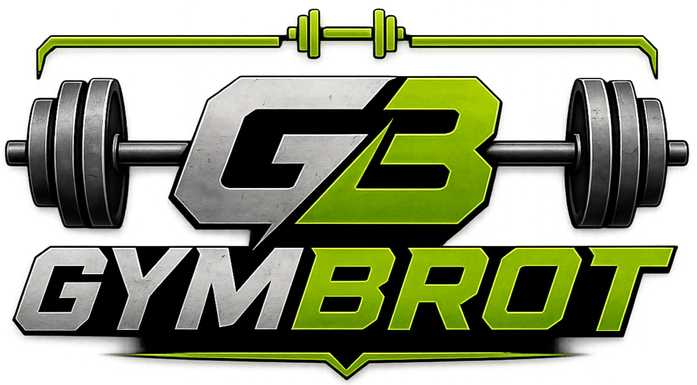

<p align="center">
  
</p>

# GYMBROT — Sistema de Gestión Integral de Gimnasios

**GYMBROT** es una aplicación de escritorio JavaFX para la administración completa de gimnasios. 
* Integra control de acceso con datos biométrico.
* Chatbot con IA.
* Sistema de notificaciones automáticas (SMS/email).
* Gestion de clientes, instructores, membresías, pagos y citas.
* Panel de progreso fisico de los clientes.
* Panel financiero con gráficos en tiempo real.

---

## Índice

- [Equipo de Desarrollo](#equipo-de-desarrollo)
- [Requerimientos del Sistema](#requerimientos-del-sistema)
- [Arquitectura del Proyecto](#arquitectura-del-proyecto)
- [Base de Datos — Esquema Oracle](#base-de-datos--esquema-oracle)
- [Paso a paso: crear la base de datos en otro PC](#paso-a-paso-crear-la-base-de-datos-en-otro-pc)
- [Instalación completa en otro PC](#instalación-completa-en-otro-pc)
- [Módulos y Funcionalidades](#módulos-y-funcionalidades)
- [Documentación Arquitectónica](#documentación-arquitectónica)
- [Compilación y Ejecución](#compilación-y-ejecución)
- [Troubleshooting](#troubleshooting)
- [Cómo contribuir](#cómo-contribuir)
- [Licencia](#licencia)

---

## Equipo de Desarrollo

| Nombre | Rol | Responsabilidad |
|---|---|---|
| Jose Antonio Chinchia Gutierrez | Líder / Scrum Master | Integración biométrica, interfaz gráfica (frontend), coordinación del equipo y revisión de Pull Requests |
| Samuel David Caro Borrero | Desarrollador 1 | Lógica del backend: capa de servicios, DAOs, reglas de negocio |
| Carlos Daniel Ospino Vivic | Desarrollador 2 | Integración del chatbot GymBrot, sistema de notificaciones (SMS/email) y apoyo al backend |
| Alberto Mario Mendoza Charris | Desarrollador 3 | Apoyo al frontend, pruebas de interfaz y asignación de tareas adicionales según avance del proyecto |

---

## Requerimientos del Sistema

### Software obligatorio

| Componente | Versión mínima | Instalación |
|---|---|---|
| **Java Development Kit (JDK)** | 21 | [Adoptium Temurin](https://adoptium.net/) |
| **Apache Maven** | 3.9+ | `winget install Apache.Maven` o manual |
| **Oracle Database XE** | 18c (PDB `XEPDB1`) | [Oracle XE 18c](https://www.oracle.com/database/technologies/xe/18c-downloads.html) |
| **ojdbc11.jar** | 23.6 | Incluido en `libs/ojdbc11.jar` |
| **SDK DigitalPersona (.NET)** | — | Necesario para `capture/CapturadorHuella.exe` (captura de huellas) |
| **Conexión a internet** | — | Para las APIs externas: Groq (chatbot), Gmail (email) y Twilio (SMS) |

### Dependencias Maven (resueltas automáticamente)

| Dependencia | Versión | Propósito |
|---|---|---|
| `org.openjfx:javafx-controls` | 21 | JavaFX base |
| `org.openjfx:javafx-fxml` | 21 | Carga de vistas FXML |
| `com.fasterxml.jackson.core:jackson-databind` | 2.17.1 | Serialización JSON (API Groq) |
| `com.sun.mail:javax.mail` | 1.6.2 | Envío de correos electrónicos |
| `com.twilio.sdk:twilio` | 9.14.0 | Envío de SMS |
| `org.mindrot:jbcrypt` | 0.4 | Hashing y verificación de contraseñas |

### SDKs externos (`.jar` en `/libs/`)

| Archivo | Versión | Propósito |
|---|---|---|
| `ojdbc11.jar` | 23.6 | Driver JDBC para Oracle |
| `dpotapi.jar` | 1.6.1 | DigitalPersona — API de captura de huella |
| `dpotjni.jar` | 1.6.1 | DigitalPersona — Binding nativo JNI |
| `dpfpenrollment.jar` | 1.6.1 | DigitalPersona — Registro de huellas |
| `dpfpverification.jar` | 1.6.1 | DigitalPersona — Verificación 1:1 |

> **Nota:** los JARs de DigitalPersona se ejecutan sobre **DLLs nativas** del SDK (p. ej. `DPAPI.dll` / `DPOTJNI.dll`). En un PC nuevo debe instalarse el **SDK de DigitalPersona (Java y .NET)** además de copiar los JARs; si el lector o las DLLs no están presentes, la aplicación arranca igual pero las funciones de huella quedan deshabilitadas.

### Hardware (opcional)

- **Lector biométrico**: DigitalPersona U.are.U (para autenticación por huella), conectado por USB.
- Requiere además el **SDK DigitalPersona Java** (DLLs nativas a runtime) y el **SDK DigitalPersona .NET** (necesario para compilar/ejecutar `capture/CapturadorHuella.exe`).

### Variables de entorno (obligatorias)

La aplicación no arranca sin estas tres variables; `DatabaseConnection` lanza un error si faltan.

```
GYMBROT_DB_URL  = jdbc:oracle:thin:@localhost:1521/XEPDB1
GYMBROT_DB_USER = gymbrot
GYMBROT_DB_PASS = tu_password
```

Configuración en **CMD**:

```bat
set GYMBROT_DB_URL=jdbc:oracle:thin:@localhost:1521/XEPDB1
set GYMBROT_DB_USER=gymbrot
set GYMBROT_DB_PASS=tu_password
```

Configuración en **PowerShell**:

```powershell
$env:GYMBROT_DB_URL="jdbc:oracle:thin:@localhost:1521/XEPDB1"
$env:GYMBROT_DB_USER="gymbrot"
$env:GYMBROT_DB_PASS="tu_password"
```

### Archivo `config.properties` (raíz del proyecto)

No se versiona (está en `.gitignore`). Debe crearse en cada PC. Claves reales usadas por el código:

```
GROQ_API_KEY=gsk_...               → Chatbot Gymbro AI
TWILIO_ACCOUNT_SID=AC...           → Notificaciones SMS
TWILIO_AUTH_TOKEN=...              → Notificaciones SMS
TWILIO_PHONE_NUMBER=+1581...       → Número remitente SMS
TWILIO_PHONE_TO=+57...             → Número fijo para SMS directos internos
GMAIL=gymbrot.notificaciones@gmail.com   → Notificaciones email
GMAIL_PASSWORD=...                 → Contraseña de aplicación Gmail
```

> Si no se configura Gmail/Twilio/Groq, la app funciona, pero las notificaciones por correo/SMS y el chatbot quedan deshabilitados (se muestra un aviso).

---

## Arquitectura del Proyecto

### Vista general (MVC)

```
FXML (Vista) ──fx:controller──> CONTROLLER ──> SERVICE ──> DAO ──> Oracle DB
      │                             │              │            │
      │                        SesionManager   HuellaUtil    DatabaseConnection
      │                        AlertaPersonalizada           (JDBC Singleton)
      │                        ValidacionUtil
      ▼
  gymbrot.css (estilos globales)
```

### Flujo de comunicación entre capas

```
┌──────────┐    llama a      ┌──────────┐    llama a     ┌──────────┐
│FXML/View │ <──fx:id─────── │Controller│ ──────────────>│ Service  │
│(layouts) │   onAction      │(eventos) │                │(negocio) │
└──────────┘                 └──────────┘                └────┬─────┘
                                                              │
                                                    llama a   │
                                                              ▼
                                                     ┌──────────────┐
                                                     │     DAO      │
                                                     │  (JDBC CRUD) │
                                                     └──────┬───────┘
                                                            │
                                                      DatabaseConnection
                                                        (Singleton)
                                                            │
                                                     Oracle Database
```

### Estructura de directorios

```
GYMBROT/
├── config.properties           ← API keys (Groq, Twilio, Gmail) — NO se sube
├── pom.xml                     ← Maven build + dependencias
├── LICENSE                     ← Licencia propietaria / uso interno
├── AUTHORS.md                  ← Autores y roles
├── README.md
├── docs/                       ← Diagramas de arquitectura (PlantUML + Mermaid)
├── libs/                       ← JARs externos (ojdbc11, DigitalPersona SDK)
├── database/                   ← Esquema Oracle
│   ├── BD                      ← Documentación de la capa
│   ├── INSTALAR_BD_GYMBROT.sql ← Script principal: crea la BD desde cero en un PC nuevo
│   ├── GYMBROT_COMPLETO.sql    ← Histórico/desactualizado
│   ├── GYMBROT_SEED.sql        ← Histórico/desactualizado
│   └── GYMBROT_RUTINAS_SEED.sql← Histórico/desactualizado
├── capture/                    ← Capturador de huella (C# + .exe) — SDK DigitalPersona .NET
│   ├── CapturadorHuella.cs     ← Código fuente C#
│   ├── CapturadorHuella.exe    ← Ejecutable compilado (se incluye en el repo)
│   └── CAPTURE                 ← Descriptor de la capa
├── .ai/                        ← Archivos de inteligencia artificial
│   └── mcp/                    ← Configuración MCP
└── src/
    ├── main/java/org/gymbrot/
    │   ├── Main.java           ← Entry point (Stage, Scene, navegación)
    │   ├── TitleBarController.java ← Barra de título personalizada
    │   ├── controller/         ← 23 controladores JavaFX
    │   ├── dao/                ← 19 Data Access Objects
    │   ├── model/              ← 19 entidades de dominio
    │   ├── service/            ← 23 servicios de negocio
    │   └── util/               ← 8 utilidades transversales
    └── main/resources/
        ├── css/gymbrot.css     ← Estilo global oscuro
        ├── fonts/              ← Lexend, Inter, Space Grotesk
        ├── fxml/               ← 22 vistas FXML
        └── images/             ← logo.png, Logo_Login.png e iconos
```

---

## Base de Datos — Esquema Oracle

### Diagrama de tablas (19 tablas)

```
                              ┌─────────────────────────────────┐
                              │           USUARIOS              │
                              │  (CC/CE/PP/TI — tipo_usuario —  │
                              │   ACTIVO/INACTIVO/SUSPENDIDO)   │
                              └───────┬──────────┬──────────┬───┘
                                      │          │          │
                        ┌─────────────┼──────────┼──────────┼──────────────┐
                        │             │          │          │              │
                        ▼             ▼          ▼          ▼              ▼
                  ┌──────────┐  ┌──────────┐ ┌──────────┐ ┌──────────┐  ┌──────────┐
                  │ CLIENTES │  │INSTRUCT. │ │ADMIN.    │ │(cuentas  │  │(futuro)  │
                  │(huella)  │  │(espec.)  │ │(rol)     │ │  de      │  │          │
                  └────┬─────┘  └────┬─────┘ └──────────┘ │sistema)  │  └──────────┘
                       │             │                    └──────────┘
                       │        ┌────▼──────────┐
                       │        │ESPECIALIDADES │
                       │        └───────────────┘
                       │
     ┌─────────────────┼──────────────┬─────────────────┬────────────────┬───────────────┐
     │                 │              │                 │                │               │
     ▼                 ▼              ▼                 ▼                ▼               ▼
┌──────────┐    ┌──────────┐    ┌──────────┐    ┌───────────┐    ┌──────────┐    ┌──────────────┐
│MEMBRESIAS│    │PROGRESOS │    │ RUTINAS  │    │   CITAS   │    │REG_INGR. │    │ SESIONES_GYM │
│ ──────── │    │          │    │ ──────── │    │(instructor│    │(huella)  │    │ ──────────── │
│PLANES_M  │    │          │    │RUT_EJERC │    │ + cliente)│    │          │    │ MENSAJES_GYM │
│ ──────── │    │          │    │ ──────── │    └───────────┘    └──────────┘    └──────────────┘
│  PAGOS   │    │          │    │ EJERCICI │
└──────────┘    └──────────┘    └──────────┘
┌──────────┐    ┌──────────────────┐
│HIST_MEM. │    │ NOTIFICACIONES   │
│(cliente+ │    │ ───────────────  │
│membresia)│    │ PLANTILLAS_MSG   │
└──────────┘    └──────────────────┘
```

### Tablas principales

| Tabla | Propósito |
|---|---|
| `USUARIOS` | Supertipo con datos comunes (nombre, correo, contraseña, foto, estado) |
| `CLIENTES` | Subtipo: dirección, fecha nacimiento, huella dactilar (BLOB) |
| `INSTRUCTORES` | Subtipo: especialidad del instructor |
| `ADMINISTRADORES` | Subtipo: rol (SUPERADMIN, ADMIN, RECEPCION) |
| `ESPECIALIDADES` | Catálogo de especialidades de instructores |
| `PLANES_MEMBRESIAS` | Catálogo de planes (mensual/semestral/anual) con precios y beneficios |
| `MEMBRESIAS` | Membresía asignada a un cliente con fechas, estado y modalidad |
| `HISTORIAL_MEMBRESIAS` | Trazabilidad de membresías asignadas a cada cliente |
| `PAGOS` | Transacciones con método (EFECTIVO, TRANSFERENCIA, TARJETA, NEQUI, DAVIPLATA) |
| `EJERCICIOS` | Catálogo de ejercicios con grupo muscular, nivel, duración |
| `RUTINAS` | Plan de entrenamiento personalizado por cliente e instructor |
| `RUTINA_EJERCICIOS` | Relación muchos-a-muchos entre rutinas y ejercicios (orden, día) |
| `PROGRESOS` | Medidas corporales (peso, altura, IMC, % grasa, masa muscular) |
| `CITAS` | Agendamiento cliente-instructor con tipo y estado |
| `REGISTROS_INGRESOS` | Control de entrada/salida con verificación biométrica |
| `NOTIFICACIONES` | Cola de notificaciones (SMS/EMAIL) con estado de envío |
| `PLANTILLAS_MENSAJE` | Plantillas reutilizables para SMS/EMAIL/WHATSAPP |
| `SESIONES_GYMBROT` | Sesiones conversacionales del chatbot por cliente |
| `MENSAJES_GYMBROT` | Mensajes individuales del chatbot con intención detectada |

### Índices

16 índices nombrados `IDX_*` sobre columnas de búsqueda frecuente: `tipo_usuario`, `correo`, `fecha_vencimiento`, `id_cliente`, `estado_envio`, etc.

---

## Paso a paso: crear la base de datos en otro PC

El script `database/INSTALAR_BD_GYMBROT.sql` crea el esquema completo desde cero. Se generó **a partir del esquema real en producción** (vía `DBMS_METADATA`), no es una copia de scripts previos.

**Contenido del script** (secciones):

| Sección | Contenido |
|---|---|
| **A** | Provisión del usuario/tablespace (opcional, como SYS) |
| **B** | 19 tablas con constraints, identities y check constraints |
| **C** | 16 índices nombrados (`IDX_*`) |
| **D** | Tipo auxiliar `NUMBER_ARRAY` |
| **E** | Paquete `PKG_GYMBROT_FUNC` (6 funciones) |
| **F** | Paquete `PKG_GYMBROT_PROC` (12 procedimientos) |
| **G** | 10 triggers |
| **H** | Datos de catálogo (admin `ADMIN001`, especialidades y planes) |
| **I** | Verificación final |

### Requisitos previos

- Oracle XE 18c instalado y **corriendo** (servicios `OracleServiceXEPDB1` / listener).
- SQL\*Plus disponible. Si `sqlplus` no se reconoce en la terminal, agrega la carpeta `bin` de Oracle al `PATH` (ver [Troubleshooting](#troubleshooting)).

### Paso 1 — Provisionar (una sola vez, como SYS)

Conecta como SYS al PDB `XEPDB1`, descomenta y ajusta la **Sección A** del script para crear el usuario y el tablespace. Ejemplo:

```
sqlplus sys as sysdba@localhost:1521/XEPDB1
```

Dentro de SQL\*Plus, descomenta las sentencias de la Sección A (crear tablespace `GYMBROT_DATA`, usuario `GYMBROT`, grants) y ejecútalas. **Este paso solo se hace la primera vez.**

### Paso 2 — Ejecutar el script (como el usuario GYMBROT)

Cuando el usuario ya exista, ejecuta el **resto del script** conectado como `gymbrot`:

```
sqlplus gymbrot/tu_password@localhost:1521/XEPDB1 @database/INSTALAR_BD_GYMBROT.sql
```

> También puedes abrir el script desde **SQL Developer** o **IntelliJ** conectados al PDB `XEPDB1` y ejecutarlo completo.

### Paso 3 — Verificar

La **Sección I** del script imprime: 19 tablas, 16 índices, los paquetes `PKG_GYMBROT_FUNC`/`PKG_GYMBROT_PROC` como `VALID`, 10 triggers, y confirma la inserción del admin `ADMIN001` + especialidades + planes.

---

## Instalación completa en otro PC

Secuencia recomendada para dejar la aplicación funcional en un equipo nuevo:

1. **Instalar Java 21** (p. ej. [Adoptium Temurin](https://adoptium.net/)). Verificar: `java --version`.
2. **Instalar Maven 3.9+**. Verificar: `mvn --version`.
3. **Instalar Oracle XE 18c** y confirmar que el PDB `XEPDB1` está arriba.
4. **Habilitar `sqlplus`** agregando `...\dbhomeXE\bin` al `PATH` (si hace falta).
5. **Crear la BD**: seguir el [paso a paso](#paso-a-paso-crear-la-base-de-datos-en-otro-pc) con `database/INSTALAR_BD_GYMBROT.sql`.
6. **Definir las variables de entorno** `GYMBROT_DB_URL`, `GYMBROT_DB_USER`, `GYMBROT_DB_PASS` (ver [Variables de entorno](#variables-de-entorno-obligatorias)).
7. **Crear `config.properties`** en la raíz del proyecto con las [claves reales](#archivo-configproperties-raíz-del-proyecto).
8. **(Opcional, huella)** Instalar el **SDK DigitalPersona** (Java y .NET), conectar el lector U.are.U; el `CapturadorHuella.exe` viene incluido en `capture/`.
9. **Compilar y ejecutar**:

```bash
mvn clean compile
mvn javafx:run
```

---

## Módulos y Funcionalidades

### 1. Login y Autenticación

- Inicio de sesión con usuario/contraseña (BCrypt)
- Validación de rol `ADMINISTRADOR`
- Indicador de estado del lector biométrico (conectado/desconectado)
- Animaciones de entrada en la tarjeta de login
- Sesión administrada por `SessionManager`

### 2. Dashboard (`/dashboard`)

- **Métricas**: total miembros activos, miembros en el gimnasio ahora, ingresos del mes
- **Gráfica de asistencia semanal**: barras por día de la semana (hoy resaltado en verde)
- **Demografía**: distribución etaria (adulto, menor, senior) con porcentajes
- **Horas pico**: histograma de 06:00 a 21:00
- **Alternancia diario/semanal** con animaciones
- Punto verde animado indicando "en vivo"

### 3. Gestión de Clientes (`/clientes`)

- CRUD completo con tabla de búsqueda y filtros
- Creación de cliente con formularios validados
- Perfil detallado: datos personales, membresía activa, progreso físico
- Asignación de membresía con selección de plan y modalidad
- Pago de membresía con selección de método

### 4. Gestión de Instructores (`/instructores`)

- CRUD completo con tabla
- Especialidades y disponibilidad
- Perfil con citas asignadas

### 5. Membresías y Planes (`/membresias`)

- Catálogo de planes con precios (mensual/semestral/anual)
- Asignación a clientes con control de fechas
- **Scheduler automático**: `MembresiaScheduler` actualiza membresías vencidas cada 24h
- Historial de membresías por cliente

### 6. Pagos (`/pago-membresia`)

- Formulario de pago con selector de método
- Métodos: EFECTIVO, TRANSFERENCIA, TARJETA, NEQUI, DAVIPLATA
- Referencia de transacción y observaciones
- Estados: EXITOSO, RECHAZADO, PENDIENTE

### 7. Finanzas (`/finanzas`)

- **Cards**: ingresos del mes, miembros activos, total ingresos
- **Gráfico de barras**: ingresos mensuales (12 meses, mes actual resaltado)
- **Gráfico de pastel**: distribución por método de pago
- **Gráfico de barras**: nuevos clientes por mes
- **Cards de ingresos por plan**
- **Tabla de pagos vencidos**
- **Historial de pagos** completo

### 8. Citas (`/citas`)

- Agendamiento de citas cliente-instructor
- Tipos: EVALUACION, SEGUIMIENTO, NUTRICION, CONSULTA
- Estados: PENDIENTE, CONFIRMADA, CANCELADA, COMPLETADA
- Perfil de cita con notas

### 9. Rutinas y Ejercicios (`/rutinas`, `/ejercicios`)

- Directorio de ejercicios con grupo muscular, nivel, series, repeticiones
- Asignación de rutinas por cliente con días de la semana
- Ejercicios ordenados dentro de cada rutina

### 10. Progreso Físico (`/progreso`)

- Registro de peso, altura, IMC, porcentaje de grasa, masa muscular
- Seguimiento histórico por cliente

### 11. Gymbro AI — Chatbot Inteligente (`/gymbro-ai`)

- Chat contextual con IA usando Groq API (LLaMA)
- Sesiones por cliente con historial persistente
- Intenciones detectadas: CONSULTA, AGENDA_CITA, VER_PROGRESO, SALUDO, NOTIFICACION
- Integración con agenda de citas y datos del cliente

### 12. Notificaciones

- **SMS**: vía Twilio API
- **Email**: vía JavaMail (Gmail SMTP)
- Plantillas de mensaje reutilizables
- Cola de notificaciones con estados (PENDIENTE, ENVIADO, FALLIDO)

### 13. Control de Ingreso Biométrico (`/registro-entrada`)

- Captura de huella con DigitalPersona U.are.U
- Verificación 1:1 contra la huella almacenada del cliente
- Registro histórico de ingresos/salidas
- Métodos de verificación: HUELLA, QR, MANUAL

---

## Documentación Arquitectónica

Los diagramas actualizados de la arquitectura completa del proyecto se encuentran en `docs/`:

| Recurso | Formato | Ubicación |
|---|---|---|
| Diagrama de clases completo (5 capas) | PlantUML | `docs/diagrama-clases.puml` |
| Diagramas por capa (modelo, dao, service, controller, util) | Mermaid | `docs/DIAGRAMA_CLASES.md` |
| Archivos individuales PlantUML | `.puml` | `docs/plantuml/` |

---

## Compilación y Ejecución

### Prerrequisitos

```bash
# Verificar Java 21
java --version

# Verificar Maven
mvn --version

# Verificar variables de entorno (ver sección "Variables de entorno")
echo %GYMBROT_DB_URL%
echo %GYMBROT_DB_USER%
echo %GYMBROT_DB_PASS%
```

### Base de datos

La BD se crea con un único script (no con varios en orden). Ver el [paso a paso](#paso-a-paso-crear-la-base-de-datos-en-otro-pc):

```bash
sqlplus gymbrot/tu_password@localhost:1521/XEPDB1 @database/INSTALAR_BD_GYMBROT.sql
```

### Compilar y ejecutar

```bash
# Compilar
mvn clean compile

# Ejecutar
mvn javafx:run
```

> **Nota para IntelliJ:** si aparece el error `Unresolved compilation problem` al ejecutar `org.gymbrot.Main`, usa **Build → Rebuild Project** (o `mvn clean compile`) y vuelve a ejecutar.

### Package (JAR)

```bash
mvn package
java --module-path target --module org.gymbrot/org.gymbrot.Main
```

---

## Troubleshooting

| Síntoma | Causa probable | Solución |
|---|---|---|
| `sqlplus` no se reconoce | La carpeta `bin` de Oracle no está en el `PATH` | Agrega `C:\app\<usuario>\product\18.0.0\dbhomeXE\bin` al `PATH` (o llama a `sqlplus` con la ruta completa) |
| `Variable de entorno faltante: GYMBROT_DB_URL/USER/PASS` | No están definidas las 3 variables | Definirlas antes de ejecutar (ver [Variables de entorno](#variables-de-entorno-obligatorias)) |
| `Unresolved compilation problem` ejecutando `org.gymbrot.Main` | Proyecto sin recompilar tras cambios | IntelliJ: **Build → Rebuild Project**; o `mvn clean compile` |
| La huella no funciona / "No se encuentra CapturadorHuella.exe" | Falta el SDK .NET de DigitalPersona o el lector U.are.U | Instalar el SDK (Java y .NET), conectar el lector USB, y verificar que `capture/CapturadorHuella.exe` existe |
| El chatbot/email/SMS no envían | Faltan claves en `config.properties` | Crear `config.properties` con las [claves reales](#archivo-configproperties-raíz-del-proyecto) |
| El script de BD da errores de "usuario ya existe" / tablespace | El esquema ya fue creado antes | Reutilizar el usuario existente (omite la Sección A) o crear un usuario nuevo |
| Mensajes con caracteres corruptos (`Musculación`) | Cliente SQL con charset `WE8MSWIN1252` | Conectarse desde un cliente con charset UTF-8 |

---

## Cómo contribuir

1. Haz **fork** del repositorio y crea una rama descriptiva (`feature/...`, `fix/...`).
2. Mantén el estilo del proyecto: sin comentarios innecesarios, siguiendo los descriptores de cada capa (`CONTROLLER`, `DAO`, `SERVICE`, `MODEL`, `UTIL`).
3. Compila con `mvn clean compile` antes de enviar un cambio.
4. Abre un **Pull Request** hacia `dev` describiendo el cambio y las pruebas realizadas.
5. **No** subas `config.properties` ni claves de API (está en `.gitignore`).

---

## Licencia

Proyecto de **uso interno — académico (Universidad Popular del Cesar, UPC)**. Distribución y uso restringidos al ámbito del proyecto. Ver el archivo `LICENSE` en la raíz del repositorio.

**Autores:** ver [AUTHORS.md](AUTHORS.md).
