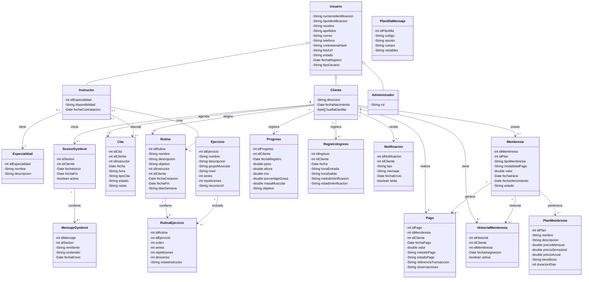

# Diagrama de Clases GYMBROT

> Generado el 18/06/2026

---

## Modelos (19 clases)

---

## DAOs (19 clases + DatabaseConnection)

```mermaid
classDiagram
    class DatabaseConnection {
        -DatabaseConnection instancia
        -Connection conexion
        +getInstance() DatabaseConnection
        +getConnection() Connection
    }

    class UsuarioDAO {
        +insertar(Usuario) int
        +buscarPorId(int) Usuario
        +buscarPorNombreOCorreo(String) List~Usuario~
        +listarTodos() List~Usuario~
        +actualizar(Usuario) boolean
        +desactivar(int) boolean
    }

    class ClienteDAO {
        +insertar(Cliente) int
        +buscarPorId(int) Cliente
        +listarTodos() List~Cliente~
        +actualizar(Cliente) boolean
        +desactivar(int) boolean
        +registrarClienteProc(Cliente) int
    }

    class InstructorDAO {
        +insertar(Instructor) int
        +buscarPorId(int) Instructor
        +listarTodos() List~Instructor~
        +listarDisponibles() List~Instructor~
        +actualizar(Instructor) boolean
        +desactivar(int) boolean
    }

    class AdministradorDAO {
        +insertar(Administrador) int
        +buscarPorId(int) Administrador
        +listarTodos() List~Administrador~
        +actualizar(Administrador) boolean
    }

    class EspecialidadDAO {
        +insertar(Especialidad) int
        +buscarPorId(int) Especialidad
        +listarTodas() List~Especialidad~
        +actualizar(Especialidad) boolean
    }

    class MembresiaDAO {
        +insertar(Membresia) int
        +buscarPorId(int) Membresia
        +listarTodas() List~Membresia~
        +listarPorCliente(int) List~Membresia~
        +insertarYRetornarId(Membresia) int
        +actualizar(Membresia) boolean
        +desactivar(int) boolean
    }

    class PlanMembresiaDAO {
        +insertar(PlanMembresia) int
        +buscarPorId(int) PlanMembresia
        +listarTodos() List~PlanMembresia~
        +actualizar(PlanMembresia) boolean
    }

    class HistorialMembresiaDAO {
        +insertar(HistorialMembresia) int
        +buscarActiva(int) HistorialMembresia
        +listarPorCliente(int) List~HistorialMembresia~
        +desactivarPorCliente(int) void
    }

    class PagoDAO {
        +insertar(Pago) int
        +listarPorCliente(int) List~Pago~
        +listarTodos() List~Pago~
        +listarTodosConCliente() List~PagoConCliente~
    }

    class CitaDAO {
        +insertar(Cita) int
        +insertarYRetornarId(Cita) int
        +buscarPorId(int) Cita
        +listarTodas() List~Cita~
        +listarPorFecha(Date) List~Cita~
        +listarPorInstructor(int) List~Cita~
        +listarPorCliente(int) List~Cita~
        +actualizar(Cita) boolean
    }

    class EjercicioDAO {
        +insertar(Ejercicio) int
        +buscarPorId(int) Ejercicio
        +listarTodos() List~Ejercicio~
        +actualizar(Ejercicio) boolean
        +desactivar(int) boolean
    }

    class RutinaDAO {
        +insertar(Rutina) int
        +buscarPorId(int) Rutina
        +listarTodas() List~Rutina~
        +buscarPorInstructor(int) List~Rutina~
        +actualizar(Rutina) boolean
        +desactivar(int) boolean
    }

    class RutinaEjercicioDAO {
        +insertar(RutinaEjercicio) int
        +listarPorRutina(int) List~RutinaEjercicio~
        +eliminarPorRutina(int) void
    }

    class ProgresoDAO {
        +insertar(Progreso) int
        +listarPorCliente(int) List~Progreso~
        +desactivar(int) boolean
    }

    class RegistroIngresoDAO {
        +insertar(RegistroIngreso) int
        +registrarEntrada(RegistroIngreso) int
        +registrarSalidaPorCliente(int) void
        +listarPorFecha(Date) List~RegistroIngreso~
        +listarPorCliente(int) List~RegistroIngreso~
    }

    class NotificacionDAO {
        +insertar(Notificacion) int
        +listarNoLeidas(int) List~Notificacion~
        +marcarcomoLeida(int) void
    }

    class PlantillaMensajeDAO {
        +insertar(PlantillaMensaje) int
        +buscarPorCodigo(String) PlantillaMensaje
        +listarTodas() List~PlantillaMensaje~
        +actualizar(PlantillaMensaje) boolean
    }

    class MensajeGymbrotDAO {
        +insertar(MensajeGymbrot) int
        +listarPorSesion(int) List~MensajeGymbrot~
    }

    class SesionGymbrotDAO {
        +insertar(SesionGymbrot) int
        +buscarActiva(int) SesionGymbrot
        +cerrarSesion(int) void
    }

    UsuarioDAO --> DatabaseConnection
    ClienteDAO --> DatabaseConnection
    InstructorDAO --> DatabaseConnection
    AdministradorDAO --> DatabaseConnection
    EspecialidadDAO --> DatabaseConnection
    MembresiaDAO --> DatabaseConnection
    PlanMembresiaDAO --> DatabaseConnection
    HistorialMembresiaDAO --> DatabaseConnection
    PagoDAO --> DatabaseConnection
    CitaDAO --> DatabaseConnection
    EjercicioDAO --> DatabaseConnection
    RutinaDAO --> DatabaseConnection
    RutinaEjercicioDAO --> DatabaseConnection
    ProgresoDAO --> DatabaseConnection
    RegistroIngresoDAO --> DatabaseConnection
    NotificacionDAO --> DatabaseConnection
    PlantillaMensajeDAO --> DatabaseConnection
    MensajeGymbrotDAO --> DatabaseConnection
    SesionGymbrotDAO --> DatabaseConnection
```

---

## Servicios (22 clases)

```mermaid
classDiagram
    class AuthService {
        +iniciarSesion(String, String) int
        +verificarHuella(byte[]) boolean
        +registrarClienteProc(Cliente) int
        +registrarInstructorProc(Instructor) int
        +hashContrasena(String) String
    }

    class AdministradorService {
        +insertar(Administrador) int
        +buscarPorId(int) Administrador
        +listarTodos() List~Administrador~
        +actualizar(Administrador) boolean
    }

    class ClienteService {
        +insertar(Cliente) int
        +buscarPorId(int) Cliente
        +listarTodos() List~Cliente~
        +actualizar(Cliente) boolean
        +desactivar(int) boolean
    }

    class InstructorService {
        +insertar(Instructor) int
        +buscarPorId(int) Instructor
        +listarTodos() List~Instructor~
        +listarDisponibles() List~Instructor~
        +actualizar(Instructor) boolean
        +desactivar(int) boolean
    }

    class EspecialidadService {
        +insertar(Especialidad) int
        +buscarPorId(int) Especialidad
        +listarTodas() List~Especialidad~
        +actualizar(Especialidad) boolean
    }

    class MembresiaService {
        +insertar(Membresia) int
        +buscarPorId(int) Membresia
        +listarTodas() List~Membresia~
        +listarPorCliente(int) List~Membresia~
        +actualizar(Membresia) boolean
        +desactivar(int) boolean
        +renovarMembresiaProc(int, int, String) void
    }

    class MembresiaScheduler {
        +iniciarProgramacion() void
        +detenerProgramacion() void
    }

    class PlanMembresiaService {
        +insertar(PlanMembresia) int
        +buscarPorId(int) PlanMembresia
        +listarTodos() List~PlanMembresia~
        +actualizar(PlanMembresia) boolean
        +formatearPrecio(double) String
    }

    class PagoService {
        +insertar(Pago) int
        +listarPorCliente(int) List~Pago~
        +listarTodos() List~Pago~
        +listarTodosConCliente() List~PagoConCliente~
    }

    class CitaService {
        +programarCita(Cita) int
        +cancelarCita(int) void
        +actualizarCita(Cita) boolean
        +diaDisponible(Date, int) boolean
        +horaDisponible(Date, String, int) boolean
    }

    class EjercicioService {
        +insertar(Ejercicio) int
        +buscarPorId(int) Ejercicio
        +listarTodos() List~Ejercicio~
        +actualizar(Ejercicio) boolean
        +desactivar(int) boolean
    }

    class RutinaService {
        +insertar(Rutina) int
        +buscarPorId(int) Rutina
        +listarTodas() List~Rutina~
        +buscarPorInstructor(int) List~Rutina~
        +actualizar(Rutina) boolean
        +desactivar(int) boolean
        +asignarEjercicios(int, List~RutinaEjercicio~) void
    }

    class ProgresoService {
        +registrarProgreso(Progreso) int
        +listarPorCliente(int) List~Progreso~
    }

    class RegistroIngresoService {
        +registrarIngresoProc(RegistroIngreso) int
        +registrarSalida(int) void
        +listarPorFecha(Date) List~RegistroIngreso~
        +listarPorCliente(int) List~RegistroIngreso~
    }

    class NotificacionService {
        +crearNotificacion(Notificacion) int
        +listarNoLeidas(int) List~Notificacion~
        +marcarLeida(int) void
    }

    class FinanzasService {
        +ingresosMesActual() double
        +ingresosPorMes() List~Object[]~
        +desgloseMetodoPago() List~Object[]~
        +nuevosClientesPorMes() List~Object[]~
        +ingresosPorPlan() List~Object[]~
        +pagosVencidos() List~Pago~
        +contarMiembrosActivos() int
        +cargarDemografia() List~Object[]~
    }

    class DashboardService {
        +contarMiembrosActivos() int
        +contarActivosHoy() int
        +ingresosMesActual() double
        +cargarDemografia() List~Object[]~
    }

    class EmailService {
        +enviarCorreo(String, String, String) void
    }

    class SmsService {
        +enviarSMS(String, String) void
    }

    class HuellaService {
        +getInstance() HuellaService
        +capturarTemplate() byte[]
        +verificarHuella(List~byte[]~) boolean
        +iniciarCaptura() byte[]
    }

    class GroqService {
        +consultarGroq(List~MensajeChat~) String
    }

    class ChatbotService {
        +procesarMensaje(int, String) String
        +iniciarSesion(int) void
        +cerrarSesion(int) void
    }

    class ConsultaGymbrotService {
        +consultar(String) String
    }

    AuthService --> UsuarioDAO
    AuthService --> ClienteDAO
    AuthService --> InstructorDAO
    AdministradorService --> AdministradorDAO
    ClienteService --> ClienteDAO
    InstructorService --> InstructorDAO
    InstructorService --> EspecialidadDAO
    EspecialidadService --> EspecialidadDAO
    MembresiaService --> MembresiaDAO
    MembresiaService --> HistorialMembresiaDAO
    MembresiaScheduler --> MembresiaDAO
    PlanMembresiaService --> PlanMembresiaDAO
    PagoService --> PagoDAO
    CitaService --> CitaDAO
    EjercicioService --> EjercicioDAO
    RutinaService --> RutinaDAO
    RutinaService --> RutinaEjercicioDAO
    ProgresoService --> ProgresoDAO
    RegistroIngresoService --> RegistroIngresoDAO
    NotificacionService --> NotificacionDAO
    FinanzasService --> PagoDAO
    FinanzasService --> MembresiaDAO
    DashboardService --> PagoDAO
    DashboardService --> MembresiaDAO
    DashboardService --> RegistroIngresoDAO
    GroqService --> SesionGymbrotDAO
    GroqService --> MensajeGymbrotDAO
    ChatbotService --> GroqService
    ChatbotService --> ClienteService
    ChatbotService --> CitaService
    ChatbotService --> MembresiaService
    ChatbotService --> RutinaService
    ChatbotService --> ConsultaGymbrotService
    ChatbotService --> SesionGymbrotDAO
    ChatbotService --> MensajeGymbrotDAO
    ConsultaGymbrotService --> ClienteDAO
    ConsultaGymbrotService --> CitaDAO
    ConsultaGymbrotService --> MembresiaDAO
    ConsultaGymbrotService --> RutinaDAO
    ConsultaGymbrotService --> ProgresoDAO
```

---

## Controladores (24 clases)

```mermaid
classDiagram
    class loginController {
        +iniciarSesion() void
        +iniciarSesionHuella() void
        -irDashboard() void
    }

    class TitleBarController {
        +cerrarVentana() void
        +minimizarVentana() void
        +maximizarVentana() void
    }

    class DashboardController {
        +initialize() void
        +cargarDashboard() void
        +irGestionClientes() void
        +irGestionInstructores() void
        +irGestionMembresias() void
        +irFinanzas() void
        +irGymbroAI() void
        +irProgreso() void
        +irGestionCitas() void
    }

    class GestionClientesController {
        +initialize() void
        +buscarCliente() void
        +abrirNuevoCliente() void
        +abrirPerfilCliente() void
        +paginarClientes() void
    }

    class GestionInstructoresController {
        +initialize() void
        +buscarInstructor() void
        +abrirNuevoInstructor() void
        +abrirPerfilInstructor() void
        +paginarInstructores() void
    }

    class GestionMembresiasController {
        +initialize() void
        +buscarMembresia() void
        +abrirPagoMembresia() void
        +paginarMembresias() void
    }

    class GestionCitasController {
        +initialize() void
        +buscarCita() void
        +abrirNuevaCita() void
        +abrirPerfilCita() void
        +cancelarCita() void
        +paginarCitas() void
    }

    class NuevoClienteController {
        +initialize() void
        +guardarCliente() void
        +capturarHuella() void
        +cancelar() void
    }

    class NuevoInstructorController {
        +initialize() void
        +guardarInstructor() void
        +cancelar() void
    }

    class NuevaRutinaController {
        +initialize() void
        +guardarRutina() void
        +agregarEjercicio() void
        +cancelar() void
    }

    class NuevaCitaController {
        +initialize() void
        +verificarDisponibilidad() void
        +agendarCita() void
        +cancelar() void
    }

    class NuevoEjercicioController {
        +initialize() void
        +guardarEjercicio() void
        +cancelar() void
    }

    class PerfilClienteController {
        +initialize() void
        +cargarDatosCliente() void
        +cargarHistorialMembresias() void
        +cargarIngresos() void
    }

    class PerfilInstructorController {
        +initialize() void
        +cargarDatosInstructor() void
    }

    class PerfilCitaController {
        +initialize() void
        +cargarDatosCita() void
        +cancelarCita() void
    }

    class PagoMembresiaController {
        +initialize() void
        +procesarPago() void
        +seleccionarPlan() void
        +cancelar() void
    }

    class ProgresoFisicoController {
        +initialize() void
        +buscarProgreso() void
        +registrarProgreso() void
        +graficarProgreso() void
    }

    class RegistroEntradaController {
        +initialize() void
        +verificarHuella() void
        +registrarEntrada() void
        +registrarSalida() void
    }

    class DirectorioRutinasController {
        +initialize() void
        +verRutina() void
        +abrirNuevaRutina() void
        +paginarRutinas() void
    }

    class DirectorioEjerciciosController {
        +initialize() void
        +buscarEjercicio() void
        +abrirNuevoEjercicio() void
        +paginarEjercicios() void
    }

    class GymbroAIController {
        +initialize() void
        +enviarMensaje() void
        +limpiarChat() void
    }

    class FinanzasController {
        +initialize() void
        +cargarIngresos() void
        +cargarDesglosePagos() void
        +cargarClientesNuevos() void
        +cargarIngresosPorPlan() void
    }

    class ChatbotController {
        +iniciarChat(int) void
        +procesarEntrada(String) String
    }

    loginController --> AuthService
    loginController --> HuellaService
    loginController --> UsuarioDAO
    DashboardController --> DashboardService
    DashboardController --> RegistroIngresoDAO
    GestionClientesController --> ClienteDAO
    GestionClientesController --> RegistroIngresoDAO
    GestionClientesController --> HistorialMembresiaDAO
    GestionInstructoresController --> InstructorDAO
    GestionInstructoresController --> EspecialidadDAO
    GestionInstructoresController --> RutinaDAO
    GestionInstructoresController --> CitaDAO
    GestionMembresiasController --> PlanMembresiaDAO
    GestionCitasController --> CitaService
    GestionCitasController --> CitaDAO
    GestionCitasController --> ClienteDAO
    GestionCitasController --> InstructorDAO
    NuevoClienteController --> AuthService
    NuevoClienteController --> HuellaService
    NuevoClienteController --> ClienteDAO
    NuevoClienteController --> UsuarioDAO
    NuevoInstructorController --> InstructorService
    NuevoInstructorController --> EspecialidadDAO
    NuevoInstructorController --> InstructorDAO
    NuevoInstructorController --> UsuarioDAO
    NuevaRutinaController --> RutinaDAO
    NuevaRutinaController --> InstructorDAO
    NuevaRutinaController --> ClienteDAO
    NuevaRutinaController --> EjercicioDAO
    NuevaCitaController --> CitaService
    NuevaCitaController --> ClienteDAO
    NuevaCitaController --> InstructorDAO
    NuevaCitaController --> HistorialMembresiaDAO
    NuevoEjercicioController --> EjercicioDAO
    PerfilClienteController --> ClienteDAO
    PerfilClienteController --> HistorialMembresiaDAO
    PerfilClienteController --> MembresiaDAO
    PerfilClienteController --> RegistroIngresoDAO
    PerfilInstructorController --> InstructorDAO
    PerfilInstructorController --> EspecialidadDAO
    PerfilCitaController --> CitaDAO
    PerfilCitaController --> ClienteDAO
    PerfilCitaController --> InstructorDAO
    PagoMembresiaController --> ClienteDAO
    PagoMembresiaController --> MembresiaDAO
    PagoMembresiaController --> HistorialMembresiaDAO
    PagoMembresiaController --> PagoDAO
    ProgresoFisicoController --> ProgresoService
    ProgresoFisicoController --> ProgresoDAO
    ProgresoFisicoController --> ClienteDAO
    RegistroEntradaController --> HuellaService
    RegistroEntradaController --> RegistroIngresoDAO
    RegistroEntradaController --> ClienteDAO
    RegistroEntradaController --> HistorialMembresiaDAO
    DirectorioRutinasController --> RutinaDAO
    DirectorioRutinasController --> InstructorDAO
    DirectorioRutinasController --> RutinaEjercicioDAO
    DirectorioEjerciciosController --> EjercicioDAO
    GymbroAIController --> ChatbotService
    GymbroAIController --> ChatbotSession
    FinanzasController --> FinanzasService
    FinanzasController --> PagoDAO
    ChatbotController --> ChatbotService
```

---

## Utilidades (9 clases)

```mermaid
classDiagram
    class DatabaseConnection {
        -DatabaseConnection instancia
        -Connection conexion
        +getInstance() DatabaseConnection
        +getConnection() Connection
    }

    class SessionManager {
        -SessionManager instancia
        -int idAdminActual
        +getInstance() SessionManager
        +getIdAdminActual() int
        +setIdAdminActual(int) void
    }

    class ChatbotSession {
        -ChatbotSession instancia
        -int idSesionActual
        -int idClienteActual
        +getInstance() ChatbotSession
        +getIdSesion() int
        +setIdSesion(int) void
        +getIdCliente() int
        +setIdCliente(int) void
        +limpiar() void
    }

    class HuellaUtil {
        +templateToBytes(DPFPTemplate) byte[]
    }

    class Validador {
        +esCorreoValido(String) boolean
        +esTelefonoValido(String) boolean
        +esIdentificacionValida(String) boolean
        +esFechaValida(String) boolean
        +campoVacio(String) boolean
    }

    class ValidacionUtil {
        +soloNumeros(int) TextFormatter
        +soloDecimales(int) TextFormatter
        +soloLetras(int) TextFormatter
        +soloLetrasYNumeros(int) TextFormatter
        +conLongitudMaxima(int) TextFormatter
    }

    class AlertaUtil {
        +mostrarError(String) void
        +mostrarInfo(String) void
        +mostrarAdvertencia(String) void
        +mostrarConfirmacion(String) boolean
    }

    class AlertaPersonalizada {
        +AlertaPersonalizada(String, String, TipoAlerta)
        +mostrar() void
        +mostrarConAnimacion() void
    }

    class SessionGymbrot {
        -int idSesion
        -int idCliente
    }
```

